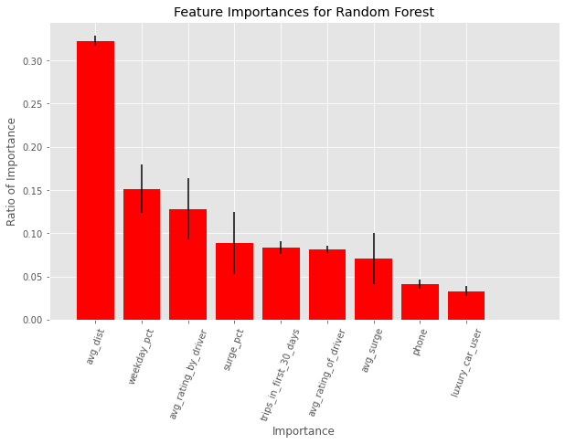

# Churn Prediction for Ride-Share Company, "Lyber"


## Table of Contents

- [Background](#Background)
- [The Task](#The-Task)
- [The Data](#The-Data)
- [Initial Hypotheses and Predictions](#Initial-Hypotheses-and-Predictions)
- [EDA](#EDA) 
- [Analysis](#Analysis)
- [Conclusion](#Conclusion)

## Background

Ride share companies are very popular in the US and worldwide, as they provide on-demand ride services for passengers in places wihtout local taxi outposts. They also are a big player in the gig-economy, where millions of people can make extra income as a ride-share driver.

Among with new goverment regulations and news scandals, ride-share apps are still wildly popular. But, many people stop using ride-share apps. We want to get to the bottom of this.

## The Task
We set out to answer this question for the ride-share company, which we will call Lyber:
- **What factors are the best predictors for retention?** 
<p>
  
To answer this question, we considered a user as a **churn** if they had not taken a trip since June 1, 2014. We used this information as our target to predict in the models we built to explore the question. We also care about building a model that minimizes error and lets us interpret the factors that contributed to our predictions.

## The Data

We were given a csv file that represented user information from data pulled on July 1, 2014

- `city`: city this user signed up in 
- `phone`: primary device for this user, either iPhone or Android
- `signup_date`: date of account registration; in the form `YYYYMMDD`
- `last_trip_date`: the last time this user completed a trip; in the form `YYYYMMDD
- `avg_dist`: the average distance (in miles) per trip taken in the first 30 days after signup
- `avg_rating_by_driver`: the rider’s average rating over all of their trips 
- `avg_rating_of_driver`: the rider’s average rating of their drivers over all of their trips 
- `surge_pct`: the percent of trips taken with surge multiplier > 1 
- `avg_surge`: The average surge multiplier over all of this user’s trips 
- `trips_in_first_30_days`: the number of trips this user took in the first 30 days after signing up 
- `luxury_car_user`: TRUE if the user took a luxury car in their first 30 days; FALSE otherwise 
- `weekday_pct`: the percent of the user’s trips occurring during a weekday

Overall, there were 50000 rows and 12 columns in the original `churn.csv ` dataset. The columns for `phone`,  `avg_rating_of_driver`, and `avg_rating_by_driver` had 396, 8122, and 201 NAN values, respectively. 


## Initial Hypotheses and Predictions 
Upon looking at the column names, and given our own experienes with ride-sharing, we thought a few features may be more important to the reason why someone would churn or stay with this ride-share.
<p>
  
- ```weekday_pct``` : We theoried that a higher weekday percentage would mean the peson is more likely using it  for work than for leisure, and this would mean a person with a higher ```weekday_pct``` would be **less** likely to churn.  
- ```avg_surge``` and ```surge_pct```: If these values are high, we think that these users may be more likely to stick with the program since they're willing to suck up the additional surge cost because they truly need this service. 
- ```avg_rating_of_driver```: maybe people hate it because they hate the drivers?
- ```phone```: A person may be more likely to churn due to the ride-share app on the specific model of phone they have (iPhone or Android). Sam made a good point about this one: Perhaps the app on a one phone model is worse than the app on another, and the user is more likely to churn because using the app is a pain in the butt. We'll leave that to the app developers once we present them with our findings.  
<p>
  
**Other Hypothesis**
The NAN values represent a type of person: For instance, the people who have NAN values for ```avg_rating_by_driver``` represent a type of person who doesn't leave ratings. That might have something to do with whether they churn. Unfortunately, that is beyond the scope of this analysis. 

## Cleaning and EDA 


### Cleaning
The cleaning pipeline is found in [clean.py](https://github.com/JCurley10/supervised-learning-case-study/blob/jess/src/clean.py)

#### Adjusting Data Types:
- `phone`: Replaced "Android" with 1 and "iPhone" with 2
- `signup_date`:  The original data was a string; we converted from a string to a datetime 
- `last_trip_date`: **Our Target**
  - First the data were converted from string to a datetime, then a boolean where "True" means they churned (the last trip date was before June 1), or "False" means they are retained (the last trip was after June 1, 2014)
  - Then the booleans were converted to integers, where 0 = the customer was retained and 1 = the customer churned.

#### Handling NAN Values:
`phone`,  `avg_rating_of_driver` `avg_rating_by_driver` had NAN values, so we decided to drop the rows that had at least one NAN value before we split our data. We decided not to impute these NAN's in the interest of time. In the end there were 33132 rows in the training dataset, `churn_train.csv` 

### EDA


 

## Analysis

### Models: Knn, Logistic Regression, Random Forest  
#### Knn

Taking a look at how a KNN model performs on the data set I first randomly gussed a K in order just to see how that would respond to the data and the confusion matrix.


For this first confusion matrix I used a K of 5. Here you can see here that the true positive is at 2081 while type I error is at 1,271 and type II error is at 1086. 

Moving forward I wanted to get a better idea what K to use, so I looked at how different values of K correlate to the MSE of the prediction. 


Here I used k values between 1-25 and calculated the MSE in each iteration to see what would be best.

I wanted to also calculate 

Finally, I chose a K value of 11 as that is when the MSE began to steady out. Then creating a confusion matrix with the new K produce slightly better results.

)

Taking a final look at the score produced by a K of 11 I found a accuracy of 0.72884.

I wanted to plot the scores vs all the different K values but didn't get to it in time.

)

#### Logistic Regression
We ran a logistic regression using K-Fold cross validation with 10 folds. The beta values for each feature were: 

- avg_dist: 0.0345
- avg_rating_by_driver: 0.1257
- avg_rating_of_driver: -0.0011
- avg_surge: 0.5629
- phone: 1.0876
- surge_pct: -0.0067
- trips_in_first_30_days: -0.1051
- luxury_car_user: -0.8486
- weekday_pct: -0.0003

The following statistics were determined from performing the cross validation:   

| **Average Accuracy** | **Average Precision** | **Average Recall** | **Average MSE** | 
| :--------: | :-------: | :-------: | :------: |
| 0.673 | 0.690 | 0.807 | 0.323| 
| 67.3% of predicions were correct based on what they really should be | 69% probability that someone actually churned given they were predicted to have churned | 80.7% probability we predict someone to churn given they actually churned | Difference between estimated and actual values| <br>  

We also created a confusion matrix to visualize the results.  


#### Random Forest

In order to implement the Random Forest model with our rideshare dataset, we decided to drop the columns for “City”, “Last Trip Date” and “Signup Date” and assign our model with the Random State of 42. After fitting the data to our training dataset our Team was impressed with the ‘out of box’ performance with the Random Forest model default parameters (Accuracy Score = 72.3%). However, we wanted to improve our Accuracy Score by fine-tuning the following hyperparameters: Number of Trees, Max Tree Depth and Minimum Samples Split. We decided to iterate through desired values and evaluate the performance of our Random Forest model. After iterating through, we ended up with the hyperparameters tuned to:

* Number of Trees = 250
* Max Tree Depth = 10
* Min Samples Split = 5

### Feature Importance Plots

After fine-tuning the Random Forest model, we plotted the Features with regard to their overall importance (see below). 



It is interesting to note that the Top 2 important features were regarding the average ride length and rides taken during the work week.  

## Conclusion
**Based on insights from the model, what plans do we propose to reduce churn?**

For our models, there were a few features that were most important in predicting if a customer churned or not. The Top 2 features based on their importance for the Random Forest are Average Distance Traveled and Percentage of Weekday Trips. When we evaluated these features from our Logistic Regression model, we found that by increasing the average distance by 1 mile there is an increase chance of churning. Also, when we look at the percentage of weekday trips it appeared that the correlation to user churn went down. So, we are proposing to incentivize riders who are traveling longer distances (i.e. longer than 10 miles) as well as riders that utilize the rideshare service outside business hours. The incentive could be 10% off the next rider’s ride fee if they take a rider longer than 10 miles or use the service during the outside of the work week.

The potential impacts of implementing these decisions will reduce the overall revenue of the rideshare company. However, by incentivizing users to take longer trips and to take trips outside the work week we believe this will lead to an increase of overall user retention. Thus, increasing the revenue of the company in the long term. One way to test out these recommendations would be to perform some A/B testing giving some users the discount while not giving the other users the discount and evaluate the retention after a period of 3-6 months.

### Using our model on the Test data
The random forest model with 250 models
- Accuracy = 0.8259
- Precision = 0.8306
- Recall = 0.8836
